<h1 align="center">Edge AI-Based Vein Detector for Efficient Venipuncture in the Antecubital Fossa (CUBITAL)</h1> 

This repository contains supplementary material for the conference paper [*"Edge AI-Based Vein Detector for Efficient Venipuncture in the Antecubital Fossa"*](https://link.springer.com/chapter/10.1007/978-3-031-47640-2_24) (MICAI 2023 Oral session). **Authors:** [Edwin Salcedo](https://www.linkedin.com/in/edwinsalcedo) and [Patricia Peñaloza](https://www.linkedin.com/in/patricia-jael-pe%C3%B1aloza-sola-6b9b65131)

[[Project page]](https://edwinsalcedo.com/publication/cubital) [[Dataset]](https://drive.google.com/drive/folders/19DaK7T81qTxgBzirvBGdMyVUj8mOCcOx?usp=sharing) [[arXiv]](https://arxiv.org/pdf/2310.18234) 

<p align="center">

</p>


## Contents
[1. Overview](#overview) </br>
* [Motivation](#motivation) </br>
* [Computer vision system](#cvsystem) </br>
* [Hardware prototype](#hardwareprototype) </br>

[2. Dataset](#dataset) </br>
* [Data collection](#datacollection) </br>
* [Preliminary results](#preliminaryresults) </br>
* [Validation data](#validationdata) </br>

[3. Getting started](#gettingstarted) </br>
[4. Citation](#citation) </br>
<br>

<a id="overview"></a> 
## 1. Overview

<a id="motivation"></a> 
### Motivation
Assessing vein condition and visibility is crucial before obtaining intravenous access in the antecubital fossa, a common site for blood draws and intravenous therapy. However, medical practitioners often struggle with patients who have less visible veins due to factors such as fluid retention, age, obesity, dark skin tone, or diabetes. Current research explores the use of near-infrared (NIR) imaging and deep learning (DL) for forearm vein segmentation, achieving high precision. However, a research gap remains in recognising veins specifically in the antecubital fossa. Additionally, most studies rely on stationary computers, limiting portability for medical personnel during venipuncture procedures. To address these challenges, we propose a portable vein finder for the antecubital fossa based on the Raspberry Pi 4B.

<a id="cvsystem"></a> 
### Computer vision system
We implemented various vein semantic segmentation models in <a href="https://github.com/EdwinTSalcedo/CUBITAL/blob/master/notebooks/Deep_Learning_based_Vein_Segmentation.ipynb
">`Deep_Learning_based_Segmentation.ipynb`</a> and selected the best-performing one—a U-Net model. We then enhanced it in <a href="https://github.com/EdwinTSalcedo/CUBITAL/blob/master/notebooks/Inference_Multi_task_U_Net.ipynb">`Inference_Multi_task_U_Net.ipynb`</a> by adding an additional head to predict the coordinates of the antecubital fossa and its angle. The final computer vision system deployed in the vein finder is shown below:

<p align="center">
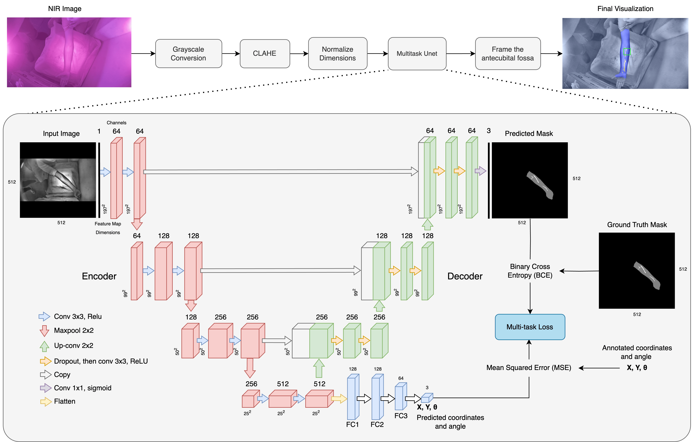
</p>

We also include plots showing the model's layers in both <a href='https://github.com/EdwinTSalcedo/CUBITAL/blob/master/images/model_plot.png'>horizontal</a> and <a href='https://github.com/EdwinTSalcedo/CUBITAL/blob/master/images/model_plot.jpeg'>vertical</a> alignment.

<a id="hardwareprototype"></a> 
### Hardware prototype

The device was designed using the 3D CAD software SolidWorks. It can be viewed by opening the file [`Ensamblaje.SLDASM`](cad/Ensamblaje.SLDASM). We also provide a detailed list of its components and visuals of the final 3D-printed prototype.

<p align="center">
  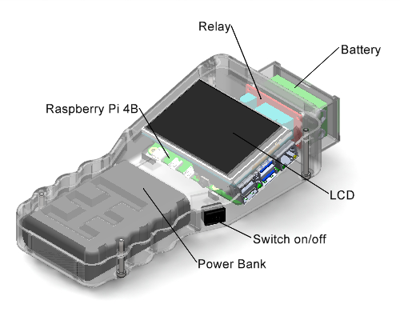
  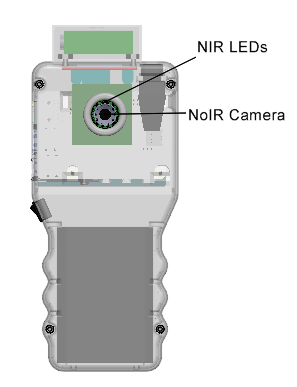
</p>

| Component | Specifications |  CAD Design |
| --- | --- | --- | 
| Power bank | <a href="https://www.amazon.com/Xiaomi-10000mAh-Portable-Charging-Delivery/dp/B08WCKLBJJ" target="_blank"> Xiaomi Mi Power Bank 3 </a> | [`Power bank`](cad/powerbank.SLDPRT) | 
| NIR Camera | <a href="https://www.raspberrypi.com/products/pi-noir-camera-v2/" target="_blank"> Raspberry Pi Camera Module 2 NoIR </a> | [`Holder`](cad/cam_holder.SLDPRT) [`Picam Noir`](cad/pi_cam.SLDPRT) [`Leds Matrix`](cad/leds_matrix.SLDPRT) |  
| LCD display | <a href="https://www.waveshare.com/3.5inch-rpi-lcd-b.htm" target="_blank"> Waveshare 3.5inch Touch Screen </a> | [`Screen`](cad/lcd_screen.SLDPRT) [`LCD Assembly`](cad/rpi_lcd.SLDPRT) |  
| Processing unit | <a href="https://www.raspberrypi.com/products/raspberry-pi-4-model-b/" target="_blank"> Raspberry Pi 4 Model B </a> | [`Raspberry Pi 4B`](cad/raspberryPi4B.SLDPRT) | 
| Relay module | <a href="https://www.amazon.com/Channel-Module-Trigger-Optocoupler-Arduino/dp/B079FJSYGY?th=1" target="_blank"> D.C. 5V 1 Channel Relay Module with Optocoupler </a> | [`Relay`](cad/relay_module.SLDPRT) |
| LED matrix | <a href="https://www.alibaba.com/product-detail/5x7cm-Placa-PCB-perforated_300011363294.html" target="_blank"> Perforated Phenolic Plate 5x7cm </a> + 12 <a href="https://www.amazon.com/Infrared-Lighting-Electronics-Components-Emitting/dp/B01BVGIZGC?th=1" target="_blank"> Infrared Ray IR 940nm Emitter LED Diode Lights </a> | [`LED Matrix`](cad/leds_matrix.SLDPRT) |
| On/off switch | <a href="https://www.amazon.com/KCD1-101-Perforate-19-13-Pin/dp/B0DCP5RSXF?th=1" target="_blank"> ON-OFF Switch 19*13mm KCD1-101 </a> | - |
| Case | - | [`Base`](cad/base.SLDPRT) [`Cover`](cad/cover.SLDPRT) [`Charger`](cad/charger.SLDPRT) |
| 9v battery holder | - | [`Case`](cad/battery_cover.SLDPRT) [`Holder`](cad/battery_holder.SLDPRT) [`Battery`](cad/battery.SLDPRT) | 
 
|  Frontal view |  Back view | Side view | Inner view |  
|---|---|---|---|
|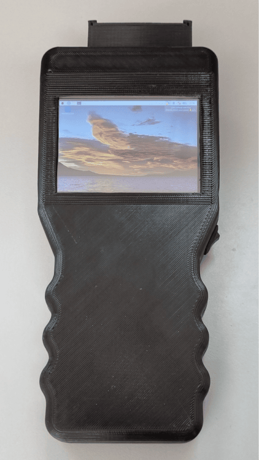 | 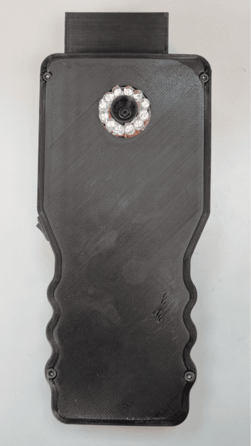 | 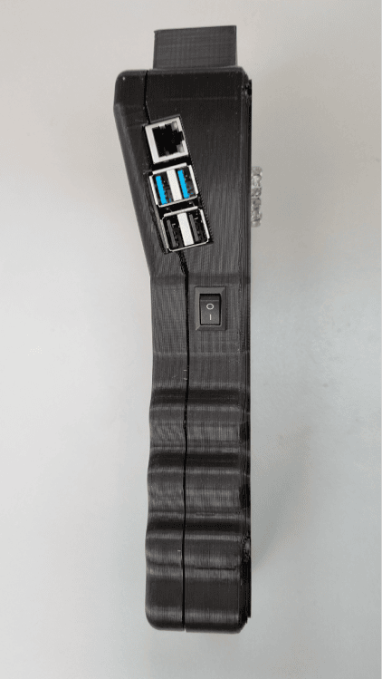 | 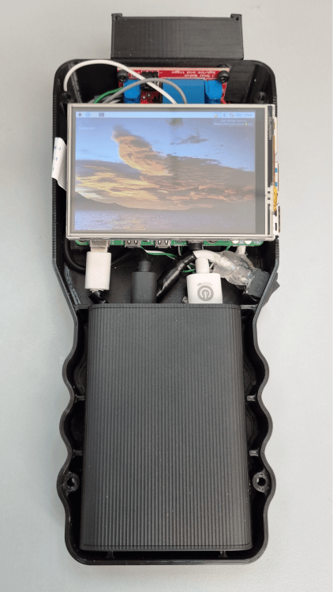 |  

<a id="dataset"></a>
## 2. Dataset

<a id="datacollection"></a> 
### Data collection

To collect the dataset, we captured 2016 NIR images of 1008 young individuals with low visibility veins. Each individual placed one arm at a time on a table, allowing us to use a preliminary version of the device to capture an NIR image. The dataset, available [here](https://drive.google.com/drive/folders/19DaK7T81qTxgBzirvBGdMyVUj8mOCcOx?usp=sharing), comes in four versions: 

- **A:** `final_dataset.zip` &rarr; Base version with complete annotations. Three samples are shown below. 
- **B:** `final_augmented_dataset.zip` &rarr; Resulting dataset after applying data augmentation to version A.
- **C:** `square_final_dataset512x512.zip` &rarr; This is a resized version of dataset A, with images reshaped to 512x512 pixels, to match the input requirements of the semantic segmentation models. 
- **D:** `square_augmented_final_dataset512x512.zip` &rarr; Similarly, resized version of B (512x512).

Below, you can see the original NIR samples, their preprocessed versions (after applying grayscale conversion and CLAHE), and their annotations: a grayscale mask overlay (with a different colormap for visualization), a dot representing the x and y coordinates of the antecubital fossa, and a floating number representing the arm angle. Furthermore, we provide a detailed explanation of the file `final_dataset.zip`, which contains the base version of the dataset.

|  NIR Images |  Preprocessed Images |  Annotations |  
|---|---|---|
|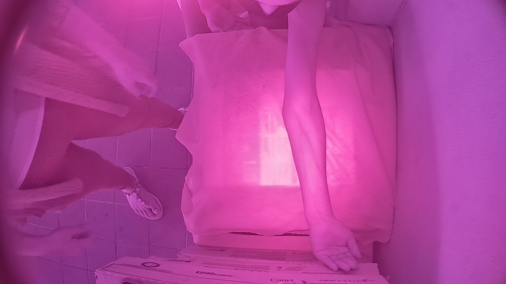 |  |  |
|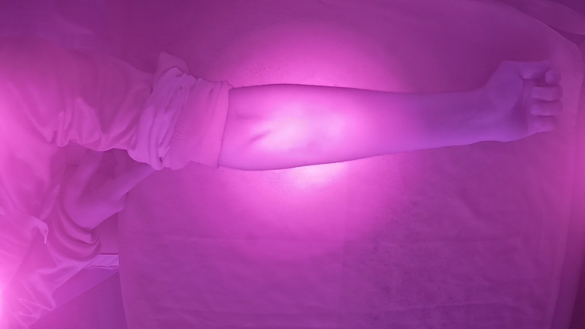 |  |  |
|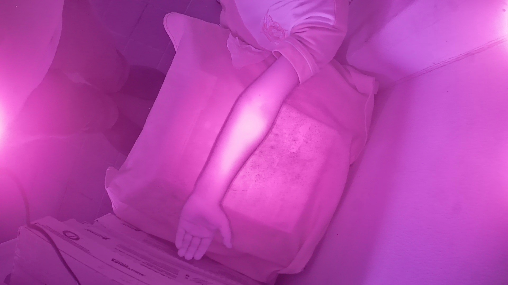 |  |  | 

``` shell
final_dataset/
------------- dataset.csv # Demographic data for each sample includes age, complexion, gender, observations, NIR image location, preprocessed image location, mask location, antecubital fossa coordinates, and arm angle. Each subject contributed two samples, one for each arm.
------------- masks/  # Grayscale images with pixel values 0,1, and 2 representing background, arm, and vein, respectively.
------------- nir_images/ # NIR images
------------- preprocessed_images/ # The same NIR images after applying grayscale conversion and CLAHE.
```

<a id="preliminaryresults"></a> 
### Preliminary results

Initial results from implementations of U-Net, SegNet, PSPNet, Pix2Pix, and DeepLabv3+ on the dataset (version C) are presented.  The results indicate that U-Net achieved the highest accuracy.  As a result, we focused further research on this method for antecubital fossa detection.

<p align="center">
  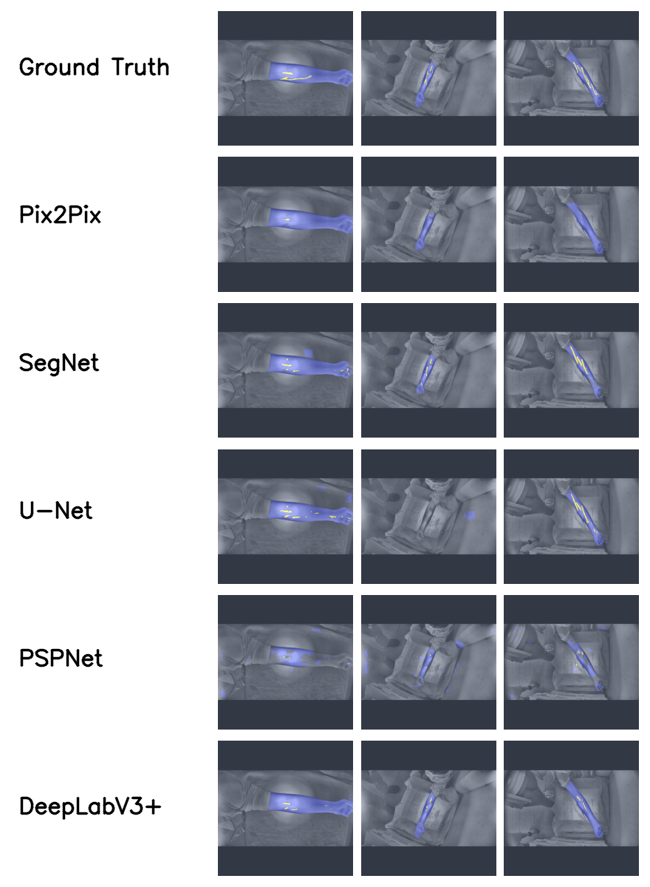
</p>

<a id="validationdata"></a> 
### Validation data

To validate the device, we asked three certified nurses to indicate the location where they would perform venipuncture on 384 samples. We saved this information in image format and shared it in the [validation](https://drive.google.com/drive/folders/1itPFfEvblAsP4ZEBzYGGOGrxNw2REc06?usp=sharing) folder, inside the dataset location. We have also included the documents signed by the nurses, confirming their consent to share the information. The annotated images can be used to compare the model's inference to the nurses' chosen venipuncture locations. We used these image subsets to evaluate the proposed device's performance, finding an 83% agreement between the regions identified by the nurses and those identified by the [U-Net](https://github.com/EdwinTSalcedo/CUBITAL/blob/master/notebooks/Validation_with_Nurse's_annotations_PyTorch_version.ipynb) vein segmentation algorithm.

<a id="gettingstarted"></a>
## 3. Getting started

In this repository, we provide a pretrained multi-task U-Net model, embedded within a complete pipeline for performing inference on NIR images included in the folder `subset/preprocessed_images`.  You can run the pipeline by following these steps:

```bash
# Clone the repository
git clone git@github.com:EdwinTSalcedo/CUBITAL.git cubital

# Create and activate a new conda environment
conda create -n new_env python=3.10.12
conda activate new_env

# Install the dependencies 
pip install -r requirements.txt

# Execute inference script
(new_env) python inference.py
```

Additionally, we include two scripts to execute the interface shown at the beginning of this repository:

```bash
# Run the next command for forearm vein segmentation. 
(new_env) python edgeai/final_interface_vein_segmentation.py 

# or, the command for vein segmentation in the antecubital fossa.
(new_env) python dgeai/final_interface_multitask.py 
```

The latter command implements the novel architecture proposed in this research. While you can execute any of these scripts using any camera, both require a NIR camera for optimal inference results. 

<a id="citation"></a>
## 4. Citation

If you find *CUBITAL* useful in your project, please consider citing the following paper:

```
@inproceedings{salcedo2023,
  title={Edge AI-Based Vein Detector for Efficient Venipuncture in the Antecubital Fossa},
  author={Salcedo, Edwin and Pe{\~n}aloza, Patricia},
  booktitle={Mexican International Conference on Artificial Intelligence},
  pages={297--314},
  year={2023},
  organization={Springer}
}
```
