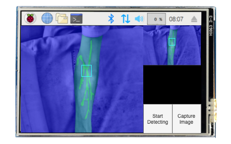
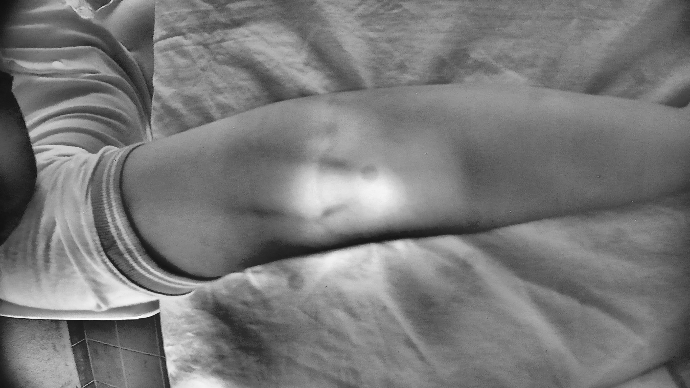
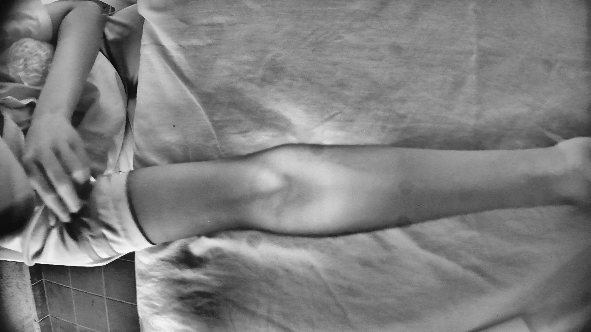

# Edge AI-Based Vein Detector for Efficient Venipuncture in the Antecubital Fossa

Official Tensorflow implementation of *"Edge AI-Based Vein Detector for Efficient Venipuncture in the Antecubital Fossa"* (MICAI 2023 Oral session)

**Edwin Salcedo, Patricia Peñaloza**

@Universidad Católica Boliviana "San Pablo"

[Paper](https://arxiv.org/pdf/2310.18234.pdf) | [Dataset](https://drive.google.com/file/d/191uA9ErYRSXculIa3AXHqfBhXjd7O3St/view?usp=sharing)

## Abstract
Assessing the condition and visibility of veins is a crucial step before obtaining intravenous access in the antecubital fossa, which is a common procedure to draw blood or administer intravenous therapies (IV therapies). Even though medical practitioners are highly skilled at intravenous cannulation, they usually struggle to perform the procedure in patients with low visible veins due to fluid retention, age, overweight, dark skin tone, or diabetes. Recently, several investigations proposed combining Near Infrared (NIR) imaging and deep learning (DL) techniques for forearm vein segmentation. Although they have demonstrated compelling results, their use has been rather limited owing to the portability and precision requirements to perform venipuncture. In this paper, we aim to contribute to bridging this gap using three strategies. First, we introduce a new NIR-based forearm vein segmentation dataset of 2,016 labelled images collected from 1,008 subjects with low visible veins. Second, we propose a modified U-Net architecture that locates veins specifically in the antecubital fossa region of the examined patient. Finally, a compressed version of the proposed architecture was deployed inside a bespoke, portable vein finder device after testing four common embedded microcomputers and four common quantization modalities. Experimental results showed that the model compressed with Dynamic Range Quantization and deployed on a Raspberry Pi 4B card produced the best execution time and precision balance, with 5.14 FPS and 0.957 of latency and Intersection over Union (IoU), respectively. These results show promising performance inside a resource-restricted low-cost device.

## Overview
<p float="left">
  
  
</p>

## Dataset samples
<p float="left">
  
  
</p>
<p float="left">
  
  
</p>

## Citation
If you find *CUBITAL* useful in your project, please consider to cite the following paper:

```
@inproceedings{salcedo2023edge,
  title={Edge AI-Based Vein Detector for Efficient Venipuncture in the Antecubital Fossa},
  author={Salcedo, Edwin and Pe{\~n}aloza, Patricia},
  booktitle={Mexican International Conference on Artificial Intelligence},
  pages={297--314},
  year={2023},
  organization={Springer}
}
```

## License
```
Copyright 2021-present "Universidad Católica Boliviana San Pablo"

Licensed under the Apache License, Version 2.0 (the "License");
you may not use this file except in compliance with the License.
You may obtain a copy of the License at

    http://www.apache.org/licenses/LICENSE-2.0

Unless required by applicable law or agreed to in writing, software
distributed under the License is distributed on an "AS IS" BASIS,
WITHOUT WARRANTIES OR CONDITIONS OF ANY KIND, either express or implied.
See the License for the specific language governing permissions and
limitations under the License.
```