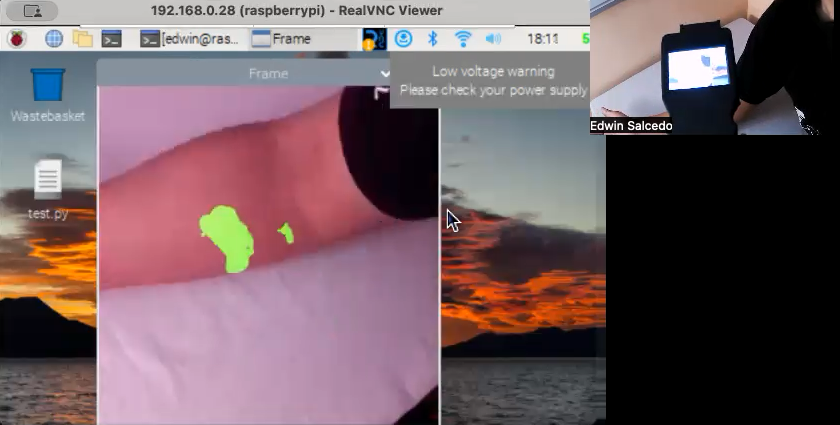
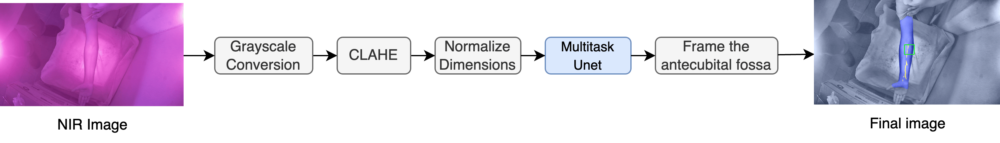
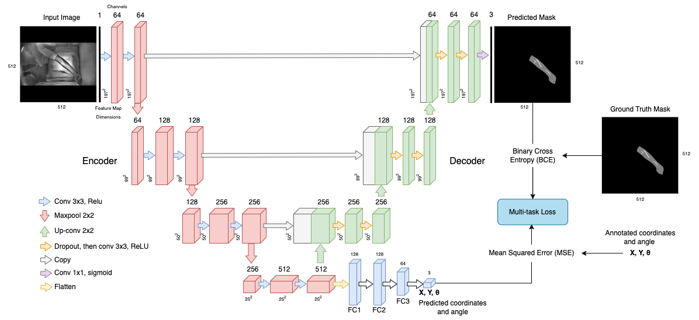
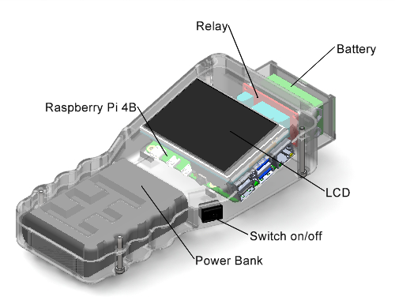
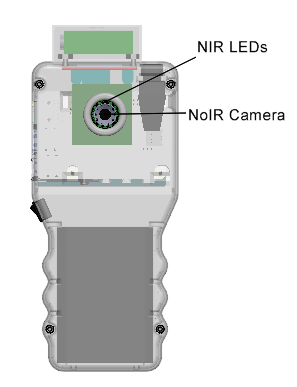

<h1 align="center">Edge AI-Based Vein Detector for Efficient Venipuncture in the Antecubital Fossa</h1> 

This repository contains supplementary material for [*"Edge AI-Based Vein Detector for Efficient Venipuncture in the Antecubital Fossa"*](https://arxiv.org/pdf/2310.18234.pdf) (MICAI 2023 Oral session). **Authors:** [Edwin Salcedo](https://www.linkedin.com/in/edwinsalcedo), [Patricia Peñaloza](https://www.linkedin.com/in/patricia-jael-pe%C3%B1aloza-sola-6b9b65131)

<p align="center">
  
</p>

<div align="center">
  <a href="#Overview"><b>Overview</b></a> |
  <a href="#Dataset"><b>Dataset</b></a> |
  <a href="#Getting Started"><b>Getting Started</b></a> |
  <!--
  <a href="#Validation"><b>Validation</b></a> |
  <a href="#Results"><b>Results</b></a> | -->
  <a href="#Citation"><b>Citation</b></a>
</div>

<br>

# Overview

## Motivation
Assessing the condition and visibility of veins is an important step before obtaining intravenous access in the antecubital fossa. This is a common procedure to draw blood or administer intravenous therapies (IV therapies). Even though medical practitioners are highly skilled at intravenous cannulation, they usually struggle to perform the procedure in patients with low visible veins due to fluid retention, age, overweight, dark skin tone, or diabetes. Commonly, SOTA investigations propose combining Near Infrared imaging (NIR) and deep learning (DL) techniques for forearm vein segmentation. However, the more detailed the localization of veins in the antecubital fossa, the more helpful it would be in reducing the time required for venipuncture.

In view of the above, we introduce a new NIR-based forearm vein segmentation dataset of 2,016 labelled images collected from 1,008 subjects with low visible veins. Second, we propose a framework that locates veins specifically in the antecubital fossa region of a patient's arm. Additionally, a compressed version of the proposed framework is embedded inside a bespoke, portable vein finder device. 

## Proposed framework and DL architecture
The framework to extract veins in the antecubital region consists of the next steps:  
<p align="center">

</p>

The segmentation model, shown in blue, is depicted in the following figure:

<p align="center">

</p>

Inference is performed with grayscale images of 512x512 pixels. The net outputs a mask, coordinates of the antecubital fossa, and an angle. 

## Proposed Hardware Device

<p align="center">
  
  
</p>

| Component | CAD Design |
| --- | --- | 
| Case | [`Base`](cad/base.SLDPRT) [`Cover`](cad/cover.SLDPRT) [`Charger`](cad/charger.SLDPRT) |
| Battery | [`Case`](cad/battery_cover.SLDPRT) [`Holder`](cad/battery_holder.SLDPRT) [`Battery`](cad/battery.SLDPRT) |  
| Camera | [`Holder`](cad/cam_holder.SLDPRT) [`Picam Noir`](cad/pi_cam.SLDPRT) [`Leds Matrix`](cad/leds_matrix.SLDPRT) |  
| LCD Screen | [`Screen`](cad/lcd_screen.SLDPRT) [`LCD Assembly`](cad/rpi_lcd.SLDPRT) | 
| Other Parts | [`Power bank`](cad/powerbank.SLDPRT) [`Relay`](cad/relay_module.SLDPRT) [`Raspberry Pi 4B`](cad/raspberryPi4B.SLDPRT) |  

The complete device can be assembled by opening the file [`Ensamblaje.SLDASM`](cad/Ensamblaje.SLDASM).

# Dataset

The database used for this work was built from scratch. 1,008 subjects with low-visible veins placed one arm at a time over a table. Then, we captured a NIR image with the initial version of the vein finder. For more specific information about the labelling process and data collection process, please refer to the paper. The final version of the dataset can be found here: [Dataset](https://drive.google.com/file/d/191uA9ErYRSXculIa3AXHqfBhXjd7O3St/view?usp=sharing). We created an additional [Dataset](https://drive.google.com/file/d/1-6hCFfxxFFCx1fuBaQODVqDVOiWPl42U/view?usp=sharing) version with normalized samples of 512x512 dimensions for immediate training with the proposed architecture. 

|  NIR Images |  Preprocessing |  Annotations |  
|---|---|---|
| |  |  |
| |  |  |
| |  |  |

<!-- # Experimental Results

## Validation

## Interface

-->

# Getting started

With the project, we provide you with one pretrained multi-task unet model, which is embedded inside a complete pipeline to generate inference given a NIR image. You can execute the latter by following the next steps: 

```bash
# Clone the repository
git clone git@github.com:EdwinTSalcedo/CUBITAL.git cubital

# Create and activate a new conda environment
conda create -n new_env python=3.10.12
conda activate new_env

# Install the dependencies 
pip install -r requirements.txt

# Exe 
python inference.py
```

The pretrained serialized models for this pipeline are placed in `edge/models`, while their detailed implementations are located in `notebooks`.

## Inference 


# Citation
If you find *CUBITAL* useful in your project, please consider to cite the following paper:

```
@inproceedings{salcedo2023,
  title={Edge AI-Based Vein Detector for Efficient Venipuncture in the Antecubital Fossa},
  author={Salcedo, Edwin and Pe{\~n}aloza, Patricia},
  booktitle={Mexican International Conference on Artificial Intelligence},
  pages={297--314},
  year={2023},
  organization={Springer}
}
```